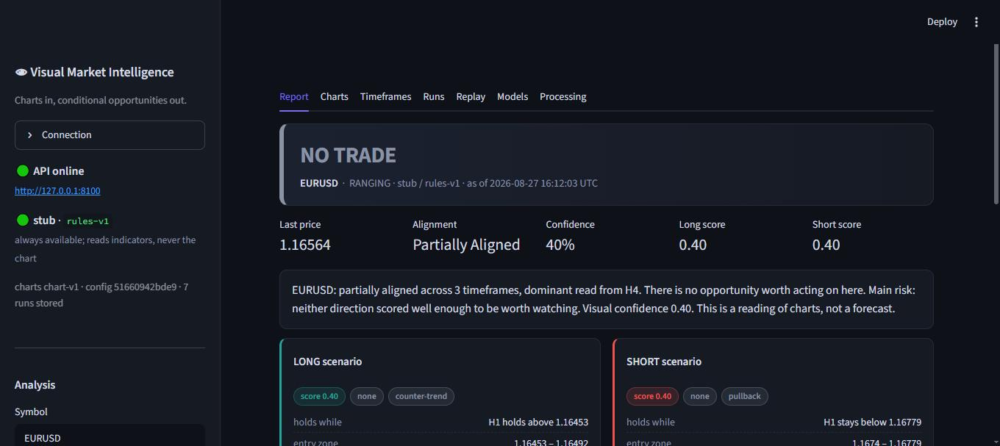

# Visual Market Intelligence

[](pyproject.toml)
[](LICENSE)
[](docs/models.md)
[](docs/models.md)

A standalone service that **looks at charts**. It renders the same candlestick
charts a human analyst would open, hands each one to a vision-language model,
and turns the three readings into **conditional market opportunities** — never a
bare BUY or SELL.

It is built to be consumed by something else. Your quantitative system keeps its
numerical agents, its forecasts and its risk engine; this is one more
specialist it can call, and the only one that sees what the chart looks like.

```
  OHLCV ──> deterministic charts ──┬─ H4 analyst   context: trend, regime, major levels
                                   ├─ H1 analyst   setup:   is there a trade here at all
                                   └─ M15 analyst  entry:   is it confirmed right now
                                          │
                                          ├─ structure synthesis    do the timeframes agree
                                          ├─ opportunity detection  both directions, conditioned
                                          ├─ risk / invalidation    can this be proved wrong
                                          └─ final report           one state, one confidence
```

**Every model it runs on is free.** A local model through [Ollama](https://ollama.com),
a free-tier hosted model through OpenRouter, any OpenAI-compatible server you
already run — or the built-in rule-based stub, which runs the entire pipeline
with no model at all so you can see it work before downloading anything. A paid
model is a one-line config change if you ever decide one is worth it.



---

## What it returns

Not this:

```
BUY EURUSD
```

This:

```
EURUSD   WATCH_LONG   (BULLISH_TRENDING)          confidence 0.71

LONG   score 0.78   quality high   type pullback
  holds while    H1 holds above 1.16453
  entry zone     1.16453 – 1.16492
  trigger        a lower-timeframe rejection of 1.16453 followed by a close
                 back above 1.16473 with momentum turning up
  invalidation   H1 closes below 1.16421 (half an ATR under the support that
                 defines the idea)
  targets        1.16779, 1.17144
  reward/risk    5.95x

SHORT  score 0.19   quality none   type counter-trend
  holds while    H1 stays below 1.16779
  …

risks
  - M15 is counter to H1 (bullish against bearish) — a pullback, or a turn
  - this is a visual reading only; nothing here accounts for news or the calendar
```

A state, both sides of the market, the conditions each depends on, the price
that proves each wrong, and what the system could not read. `NO_TRADE` is a
first-class answer and the system returns it often.

---

## Quickstart

```bash
git clone <this repository> "Vision Agent" && cd "Vision Agent"
uv venv && uv pip install -e .          # or: python -m venv .venv && pip install -e .
```

### 1. See it work with no model at all

```bash
vmi analyze EURUSD --provider stub
```

The `stub` backend does not look at the image — it applies moving-average and
oscillator rules to the indicator values and says so in every line of its
output. It exists to prove the plumbing, to give regression runs something
deterministic, and to be the floor a real vision model has to beat.

### 2. Add a free local model

```bash
# install Ollama from ollama.com, then:
ollama pull qwen2.5vl:7b        # ~6 GB, the best free local chart reader
vmi analyze EURUSD              # ollama is the default provider
```

On a CPU-only laptop expect one to three minutes per chart. `qwen2.5vl:3b` is
about three times faster and still usable. See [docs/models.md](docs/models.md).

### 3. Or a free hosted model, no download

```bash
# free key at openrouter.ai/keys — the ":free" models cost nothing
export VMI_VISION__PROVIDER=openrouter
export VMI_VISION__MODEL='qwen/qwen2.5-vl-72b-instruct:free'
export VMI_VISION__API_KEY=sk-or-...
vmi analyze EURUSD
```

### The console

```bash
vmi console          # or: streamlit run ui/streamlit_app/app.py
```

It starts the API itself if nothing is answering. Everything the console can do
is available from the CLI and the HTTP API — that is what makes a result
reproducible rather than a screenshot.

---

## What the model is shown

Charts are rendered by this project, deterministically, and versioned
(`chart-v1`). The same bars always produce the same PNG, and the image hash is
stored with the run — a report drawn against a different picture is not
comparable with the ones before it.


Two design choices are about the reader being a model rather than a person:

- **Prices are printed inside the plot.** A vision model cannot interpolate an
  axis accurately, but it can read a number. Eight labelled horizontal rules turn
  "read the support level" into "read the nearest printed number".
- **Bars are positioned by index, not by timestamp.** The weekend gap in FX and
  the overnight gap in equities otherwise leave holes that a model reads as
  structure.

Support and resistance are computed from swing pivots and drawn on the chart, so
the model has something to anchor to — and so any level it reports can be checked
against the range the chart actually covers. Levels outside that range are
discarded and reported in `rejected_levels`, because a price that was never on
the chart was not read, it was invented.

---

## The timeframe ladder

| Timeframe | Role | Indicators | The question it answers |
|---|---|---|---|
| H4 | context | EMA 50/200, Bollinger, RSI, MACD, ATR, volume, levels | What is the broader structure? |
| H1 | setup | EMA 20/50/200, Bollinger, RSI, MACD, ATR, volume, levels | Is there a trade here at all? |
| M15 | entry | EMA 9/20/50, RSI, MACD, ATR, volume, levels | Is it confirmed right now? |

Configurable in [`configs/default.yaml`](configs/default.yaml) — D1/H4/M30 or
W1/D1/H4 work with no code change, because weights come from the *role*, not the
interval.

Each analyst sees **one** chart and knows nothing about the others. That
independence is the point: an analyst told what the higher timeframe concluded
will agree with it, and three agreeing agents that were never independent are one
agent wearing three hats.

The H4 analyst is given a schema in which `setup` may only be `NO_SETUP`. A model
that cannot answer "should I buy" cannot bias the rest of the chain.

---

## Architecture

Perception is a model. Arbitration is code.

```
interfaces/     HTTP API and CLI — how the outside world asks
application/    the eight agents and the pipeline that sequences them
domain/         the vocabulary: charts, observations, opportunities, ports
infrastructure/ the replaceable parts: feeds, chart drawing, vision models, storage
```

Only the three timeframe analysts call a vision model. Structure synthesis,
opportunity detection, risk and reporting are deterministic Python, because "the
timeframes disagree, so halve the score" is a rule — and a rule written in code
can be read, argued with, changed in one place and replayed identically a year
later. Asking a language model to re-derive it on every run buys nothing and
costs reproducibility.

Nothing in `domain/` imports anything else in the package. That is what lets the
vision model, the price feed and the chart renderer all be swapped without the
agents noticing. Full detail in [docs/architecture.md](docs/architecture.md).

### Swapping the vision model

```python
class VisionModel(Protocol):
    provider: str
    model: str

    def analyze(self, image_b64: str, prompt: str, system: str | None) -> str: ...
    def available(self) -> tuple[bool, str]: ...
    def list_models(self) -> list[dict]: ...
```

Four implementations ship: `ollama`, `openai_compatible` (llama.cpp, LM Studio,
vLLM, Jan…), `openrouter`, and `stub`. A paid vendor is a subclass of the
OpenAI-compatible one with a different host.

---

## The API

```bash
vmi serve            # http://127.0.0.1:8100, docs at /docs
```

```http
POST /analyze
{ "symbol": "EURUSD", "timeframes": ["H4","H1","M15"], "as_of": null }
```

```json
{
  "symbol": "EURUSD",
  "run_id": "EURUSD-20260827T161203-878b14",
  "current_state": "WATCH_LONG",
  "market_regime": "BULLISH_TRENDING",
  "opportunities": { "long": { … }, "short": { … } },
  "key_levels": { "support": [1.16453], "resistance": [1.16779, 1.17144] },
  "alignment": "ALIGNED_BULLISH",
  "confidence": 0.71,
  "risks": ["…"]
}
```

| Endpoint | What it does |
|---|---|
| `GET /health` | is the vision backend reachable, which chart version, how many runs |
| `POST /analyze` | symbol in, report out |
| `POST /analyze/charts` | your own PNGs in, report out (for data that cannot leave your network) |
| `GET /models` · `POST /models/select` · `POST /models/pull` | inspect, switch and download backends |
| `GET /runs` · `GET /runs/{id}` · `GET /runs/{id}/chart/{tf}` | the run index, one report, the exact PNG the model saw |
| `POST /replay` | walk history and score the calls |

Full reference: [docs/api.md](docs/api.md).

---

## Evaluation — the part that makes it a system rather than a demo

Every run is stored: the report, the charts, the raw model text, the model id,
the prompt version, the chart version and the `as_of` cut-off. That is enough to
ask the only question that matters:

> When it said `WATCH_LONG`, what actually happened next?

```bash
vmi replay EURUSD --start 2026-08-01 --end 2026-08-25 --step 24h --out reports/eurusd.csv
```

```
                runs  mean_signed_20  median_signed_20  target_first_rate  mean_confidence  share
state
WATCH_LONG         8          0.0391            0.0347              0.857           0.6328  0.727
LONG_TRIGGERED     1         -0.0462           -0.0462              0.000           0.5890  0.091
NO_TRADE           1          0.0000           -0.0000                NaN           0.4160  0.091
WATCH_SHORT        1          0.0231            0.0231              1.000           0.5170  0.091
```

`mean_signed_N` is the forward return over N bars multiplied by the direction the
state asserted — positive means the call was right on average.
`target_first_rate` is how often the system's **own published target** was touched
before its **own published invalidation**, which is the honest test because it
uses the levels the report committed to rather than a horizon chosen afterwards.

Replay cannot see its own future. The cut happens in exactly one place —
`market_data.base.apply_as_of` — every provider routes through it, and a bar that
closes after the cut-off is dropped even if the cut falls inside it. Bars are
right-stamped throughout for the same reason.

This is not a backtest: no sizing, no costs, no compounding. What it can tell you
is whether the states mean anything at all. If `WATCH_LONG` and `WATCH_SHORT`
have the same forward-return distribution, the system is not seeing what it
claims to see — and you should know that before wiring it into anything.

---

## Data

| Provider | Use it for | Notes |
|---|---|---|
| `yahoo` (default) | FX, equities, crypto, indices, futures | free, no account; H4 is resampled from H1 because Yahoo has no 4-hour bars |
| `metatrader` | FX with real H4 bars and tick volume | Windows + a running terminal; `uv sync --extra mt5` |
| `csv` | reproducible studies, history older than Yahoo keeps | drop `EURUSD_H1.csv` in `data/samples/` |

Symbols are typed the way a person says them — `EURUSD`, `BTCUSD`, `XAUUSD`,
`AAPL`, `SPX500` — and translated to each feed's spelling.

---

## Configuration

One file, [`configs/default.yaml`](configs/default.yaml), overridden by
`VMI_<SECTION>__<FIELD>` environment variables (see [`.env.example`](.env.example)):

```bash
VMI_VISION__PROVIDER=ollama
VMI_VISION__MODEL=qwen2.5vl:7b
VMI_VISION__GROUNDING=window     # none | window | full
VMI_DATA__PROVIDER=yahoo
```

`grounding` deserves a word. At `window` — the default — the prompt states the
price band the chart covers, all of which is already printed on the chart. At
`none` the model gets nothing but the picture: the purest test of chart reading,
and the setting where a weak model most often invents a price. At `full` it also
receives the computed levels and indicator values, which raises accuracy and
means the reading is no longer purely visual — say so in any write-up that uses
it. The methodology is in [docs/methodology.md](docs/methodology.md).

---

## What this is not

- **It is not a trading system.** There is no execution, no position sizing, no
  portfolio. It publishes conditions; deciding to act on them is someone else's
  job, deliberately.
- **It is not a forecast.** A chart pattern is evidence, never a guarantee, and
  the prompts say so to the model as firmly as this says it to you.
- **It is not calibrated.** The confidence number is a weighted average of agent
  agreement, not a probability of anything. Replay it against your own instrument
  before you trust the scale.
- **Small local models make mistakes reading axes.** That is why levels are
  validated against the drawn range, why the swing-point levels exist as a
  fallback, and why `rejected_levels` is in every report.

---

## Documentation

| Document | What is in it |
|---|---|
| [docs/architecture.md](docs/architecture.md) | layout, data flow, module contracts, extension points |
| [docs/methodology.md](docs/methodology.md) | why charts, why this ladder, grounding, scoring, leakage |
| [docs/code_orchestration_to_output.md](docs/code_orchestration_to_output.md) | one command, followed line by line, from CLI to report |
| [docs/api.md](docs/api.md) | every endpoint, with request and response shapes |
| [docs/models.md](docs/models.md) | free models, hardware, what to install first |
| [docs/evaluation.md](docs/evaluation.md) | replay, outcome scoring, how not to fool yourself |
| [docs/deployment.md](docs/deployment.md) | running it locally, as a service, or in the cloud |
| [docs/novice_learner.md](docs/novice_learner.md) | the whole thing explained without jargon |

---

## Integrating it with a quant platform

Treat the whole subsystem as one external specialist:

```
                MAIN QUANT SYSTEM
                       │
       ┌───────────────┼────────────────┐
       ↓               ↓                ↓
 numerical         forecast          risk
 agents             agents           agents
       │               │                │
       └───────────────┼────────────────┘
                       ↓
             ┌────────────────────┐
             │  VMI  POST /analyze│  ← this repository, its own process
             └─────────┬──────────┘
                       ↓
              a conditional opportunity
                       ↓
                decision agent
```

Run it where the GPU is (or where the free API key is), call it when a symbol is
worth a second opinion, and store the `run_id` with whatever you decide — so that
six months later you can ask what the charts looked like when you decided it.

## License

MIT — see [LICENSE](LICENSE).
