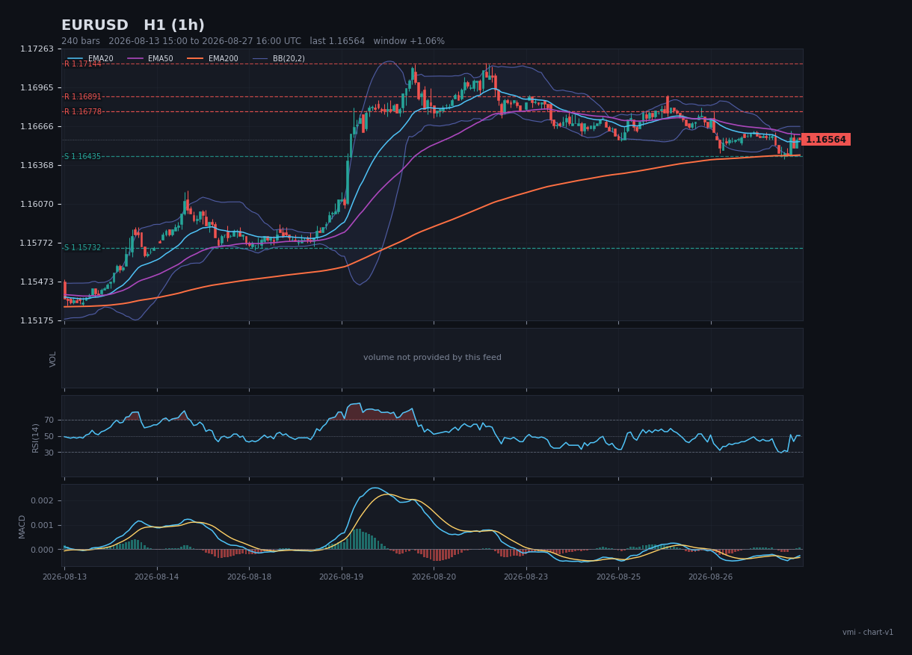

# The whole thing, explained without jargon

For someone who has not spent years staring at price charts, and would like to
understand what this program actually does before reading any code.

---

## 1. What problem is this solving?

People who trade for a living look at charts. Not because the picture contains
information the numbers do not — it does not, strictly — but because a picture
makes certain relationships obvious that are awkward to write down. *"Price keeps
stopping at the same level."* *"This move is running out of steam."* *"We are
squeezed into a narrowing wedge."*

Computers are excellent with the numbers and, until recently, useless with the
picture. Models that can look at an image and describe it changed that. So the
question this project asks is:

> If we show a chart to a model that can see, is what it says useful — and can we
> check?

The second half is the hard part, and most of this repository is about it.

---

## 2. What is a candlestick chart?

Time runs left to right. Each candle covers a fixed slice of time — fifteen
minutes, one hour, four hours — and records four numbers about that slice:

- where the price **opened**,
- the **highest** it reached,
- the **lowest** it reached,
- where it **closed**.

The thick body spans open to close; it is green when the close is higher than the
open and red when lower. The thin lines above and below — "wicks" — reach to the
high and the low.



The coloured lines through the candles are **moving averages**: the average price
over the last 20, 50 or 200 candles, redrawn at every candle. They smooth the
noise, and their order tells you something — when the fast average is above the
slow one, recent prices have been higher than older ones.

The three strips underneath are helpers:

- **Volume** — how much traded. Empty here, because free foreign-exchange feeds do
  not publish it, and the chart says so rather than drawing a flat line the model
  might read as a collapse.
- **RSI** — a number from 0 to 100 measuring how one-sided recent moves have been.
  Above 70 is often called "overbought", below 30 "oversold". They are
  descriptions, not predictions.
- **MACD** — the difference between two moving averages, plus a smoothed version
  of that difference. It is a way of asking whether a move is speeding up or
  slowing down.

The dashed horizontal lines are **support** and **resistance**: prices where the
market has turned around before. This program computes them from the data rather
than eyeballing them, and draws them so the model has something to anchor to.

---

## 3. Why three charts instead of one?

The same market looks different depending on how much of it you can see.

- A **four-hour** chart shows the last month or two. It answers *"what is going on
  in general?"*
- A **one-hour** chart shows the last week or so. It answers *"is there something
  worth doing here?"*
- A **fifteen-minute** chart shows the last few days. It answers *"is now the
  moment?"*

Asking one analyst all three questions produces mush. So the program asks three
separate analysts one question each, and — this is the important part — **none of
them is told what the others said**.

Why? Because these models are agreeable. Tell one "the bigger picture is
bullish" and it will find bullishness. Three analysts who were told what to think
and then agreed have told you nothing. Three independent readings that agree have
told you something real, and three that *disagree* have told you something even
more useful: this market is not clear, and the program can say so instead of
guessing.

---

## 4. What comes out

Not "buy". This:

```
EURUSD   WATCH_LONG                       confidence 0.71

LONG   score 0.78   quality high   type pullback
  holds while    the hourly chart stays above 1.16453
  entry zone     1.16453 – 1.16492
  trigger        a rejection of 1.16453 on the fifteen-minute chart, then a
                 close back above 1.16473 with momentum turning up
  invalidation   the hourly chart closes below 1.16421
  targets        1.16779, 1.17144
```

Read it as a sentence with conditions:

- **holds while** — what has to remain true for the idea to make sense at all.
- **entry zone** — where you would be interested, if the trigger fires.
- **trigger** — the event that turns interest into action. Until it happens,
  nothing happens.
- **invalidation** — the price at which you were simply wrong. This one is
  non-negotiable: an idea with no invalidation is an opinion, and the program's
  risk agent throws those away.
- **targets** — where it might go, if it works.

And the state at the top tells a consuming system what to do *right now*:

| State | Meaning |
|---|---|
| `NO_TRADE` | nothing here. The most common answer, and a perfectly good one |
| `WAIT` | both directions are arguable, which is a reason to sit still |
| `WATCH_LONG` / `WATCH_SHORT` | one side looks better; its trigger has not fired |
| `LONG_TRIGGERED` / `SHORT_TRIGGERED` | the conditions are met right now |

The program is built to be comfortable saying nothing. A system that finds an
opportunity in every chart has not found opportunities; it has found a way to
always answer.

---

## 5. How does the program decide?

In two very different halves, and the split is deliberate.

**Half one: looking.** Three model calls, one per chart. Each returns a
structured description — trend, strength, regime, momentum, volatility, levels,
patterns, whether it sees a setup, how confident it is, and a list of what it
could **not** read.

**Half two: thinking.** Everything after that is ordinary code — arithmetic and
rules written down in Python. Do the timeframes agree? How much does a
disagreement cost? Where exactly is the entry, the stop, the target? Is the
reward worth the risk?

Why not let the model do the thinking too? Because a rule written in code can be
read, argued with and changed in one place, and it gives the same answer next
year. A model asked to re-derive it gives a slightly different answer every time,
and when the score changes you cannot tell whether the market changed or the
model did.

There is also a practical benefit: two runs with the same three readings produce
identical conclusions, so any difference between two runs is caused by the
*looking*, which is the part under study.

---

## 6. How do we know if it works?

This is the part most demos skip.

Every run is stored — the report, the exact pictures, the exact model reply, the
model's name, the version of the prompt, the version of the chart drawing. That
is enough to go back through history and ask:

> When it said `WATCH_LONG`, what did the price actually do next?

The program can be pointed at a moment in the past and asked to analyse the
market **as it looked then**. Everything after that moment is deleted before the
charts are drawn — not filtered later, deleted, in one function that every data
source is forced through. Then, afterwards, the real future is fetched and the
call is scored:

- what the price did over the next 10, 20 and 50 candles,
- whether the program's **own** target was reached before its **own**
  invalidation.

That second measure is the honest one, because it uses the numbers the program
committed to in advance rather than a horizon chosen afterwards to flatter it.
And when a single candle touches both the target and the stop, the stop wins —
because from a candle you cannot tell which came first, and a scoring rule that
guesses in its own favour is how people convince themselves of things that are
not true.

---

## 7. What it costs

Nothing. Every model it can use is free:

- a model running on your own computer (via Ollama — a download, then no
  internet needed),
- a free-tier hosted model (OpenRouter — a free key, no download),
- or no model at all: a built-in "stub" that applies simple arithmetic rules to
  the indicators. It does not look at the picture and says so on every line. It
  exists so you can watch the whole machine work before downloading anything —
  and as a bar the real model has to clear. If a vision model cannot beat simple
  arithmetic on replayed history, it is not earning its electricity.

---

## 8. What it is not

- **Not a trading system.** It never places an order, sizes a position, or knows
  what you own. It publishes conditions; deciding to act is someone else's job.
- **Not a prediction.** A chart pattern is evidence. Markets are not obliged to
  respect it, and both the prompts and the reports say so.
- **Not aware of the world.** It sees a picture of prices. A central bank meeting
  in an hour is invisible to it.
- **Not calibrated.** "Confidence 0.71" means the agents agreed strongly, not that
  something is 71% likely. Turning it into a real probability means measuring it
  against outcomes on your own market — which this program makes possible and
  does not do for you.

---

## 9. Where to go next

| If you want to… | Read |
|---|---|
| run it | the [README](../README.md) |
| understand the structure | [architecture.md](architecture.md) |
| understand the reasoning behind the design | [methodology.md](methodology.md) |
| follow one command through every line | [code_orchestration_to_output.md](code_orchestration_to_output.md) |
| pick a model | [models.md](models.md) |
| check whether it works | [evaluation.md](evaluation.md) |
